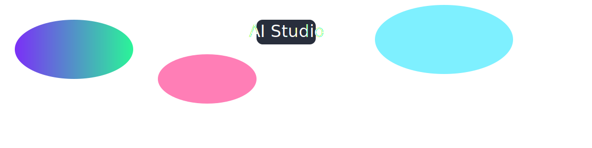

# 👋 Hi, I'm Codur

<!-- FLOATING_SVG -->

---

## 🔧 Tools & Tech I Use

| Category | Tools |
|----------|-------|
| **AI & ML** | 🧠 AI Studio · 🤖 PyTorch · TensorFlow |
| **Languages** | 🐍 Python · ⚡ JavaScript · 🖥️ C++ |
| **Data** | 📊 Pandas · SQL · Jupyter |
| **Cloud & APIs** | ☁️ AWS · GCP · REST APIs |
| **Creative Tech** | 🎨 Generative AI · 🖌️ Design Tools |

---

## ⏱️ Live Status (auto-updating)

_Current time (UTC): **`<!--TIME-->`**_

🔄 This section updates every hour with GitHub Actions.

---

## 📊 GitHub Stats

---

## 🌟 Featured Projects

🔹 [**AI Studio Experiments**](https://github.com/YOUR_USERNAME/ai-studio-experiments) — Creative AI apps & experiments built in AI Studio.
🔹 [**Data Science Toolbox**](https://github.com/YOUR_USERNAME/data-science-toolbox) — Reusable notebooks, datasets, and utilities.
🔹 [**Interactive Visuals**](https://github.com/YOUR_USERNAME/interactive-visuals) — Dynamic SVG & animation demos.

---

## 🌍 Connect With Me

---

✨ *“Keep building. Keep learning. Keep creating.”*
